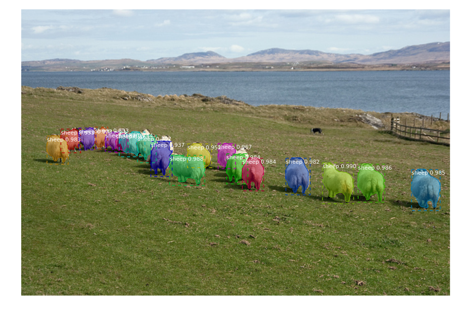

# Mask-R-CNN-for-Image-Segmentation

## Mask R-CNN for object detection and instance segmentation w/ Python 3, Keras, and TensorFlow. 

The model generates bounding boxes and segmentation masks for each instance of an object in the image

